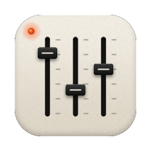
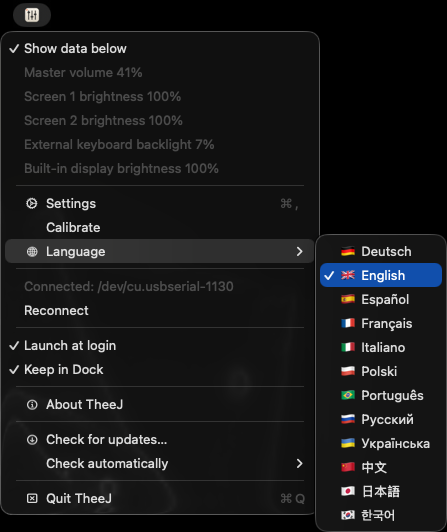
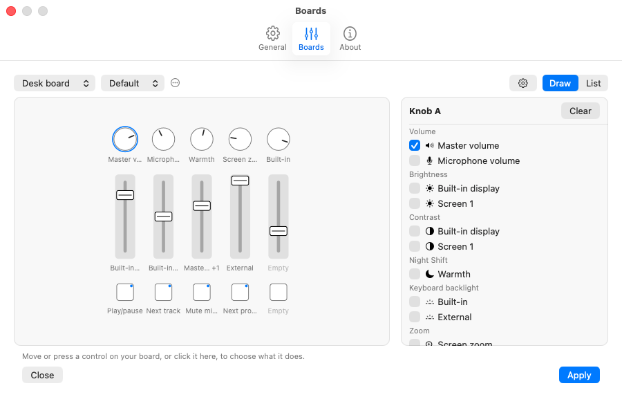
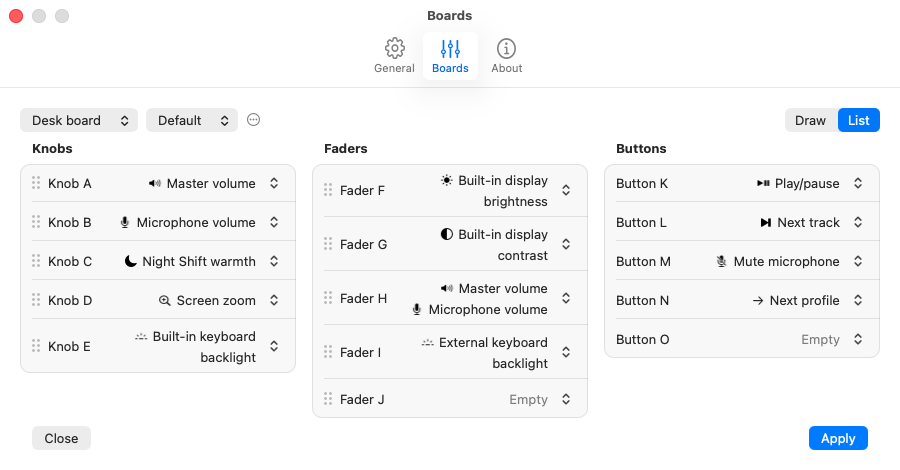
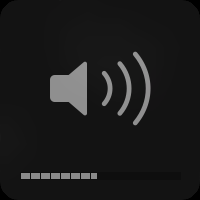
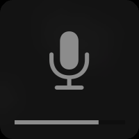
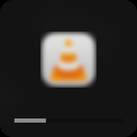
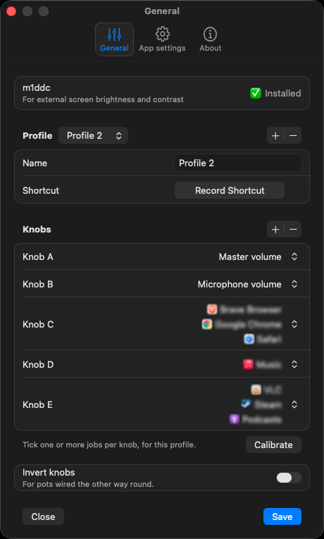
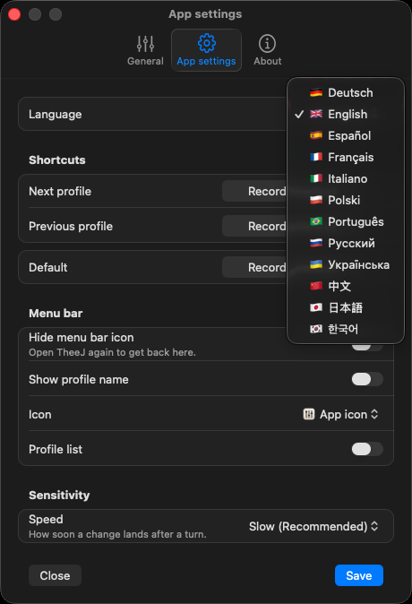
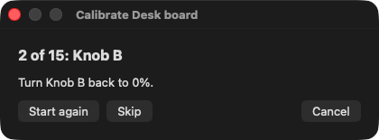

<p align="center">
  
</p>

<h1 align="center">TheeJ</h1>

<h3 align="center">Real knobs for your Mac.</h3>

<p align="center">
  The Mac client for <a href="https://github.com/omriharel/deej">deej</a>. Volume for your Mac and your apps, brightness and more,<br>
  straight from the Arduino or MIDI mixer on your desk.
</p>

<p align="center">
  <a href="https://github.com/zolferfigueiredo/theej/releases/latest"></a>
  <a href="https://www.swift.org"></a>
  
  <a href="LICENSE"></a>
  <a href="https://github.com/zolferfigueiredo/theej/actions/workflows/ci.yml"></a>
</p>

<p align="center">
  <a href="https://github.com/zolferfigueiredo/theej/releases/latest"><b>Download for macOS</b></a>
  &nbsp;·&nbsp;
  <a href="https://theej.zolfer.com">Try the mixer in your browser</a>
</p>

<p align="center">On Windows? Get <a href="https://weej.zolfer.com">WeeJ</a>.</p>

<p align="center">
  
</p>
<p align="center"><a href="#screenshots"><b>More screenshots</b></a></p>

## Install

1. [Download the DMG](https://github.com/zolferfigueiredo/theej/releases/latest), open it and drag TheeJ to Applications.
2. Open TheeJ. It's signed and notarized by Apple, so macOS only asks you to confirm the first time. It then asks which language to use, starting from your Mac's.
3. Settings opens on General and asks how many boards you have, then adds them one after another: pick DIY (Arduino), SMC-Mixer or Other MIDI, and plug it in. A deej board or another MIDI controller is calibrated next, an SMC-Mixer needs none, and the Boards tab then shows them to choose what each control does.

Or install it with [Homebrew](https://brew.sh/):

```bash
brew tap zolferfigueiredo/theej https://github.com/zolferfigueiredo/theej
brew install --cask theej
```

You need:

- macOS 14 or later, on Apple silicon or Intel
- Any deej board, over USB, and your Arduino sketch stays as it is. Or an M-VAVE SMC-Mixer, over USB or Bluetooth MIDI, or any other MIDI controller. As many as you like, at once.
- For external screens: Apple silicon and [m1ddc](https://github.com/waydabber/m1ddc) (`brew install m1ddc`)
- For one app's volume: macOS 14.2 or later
- TheeJ in Applications, for launch at login and updates

**Quit MonitorControl, BetterDisplay or any similar app first.** Two apps writing the same screen over I2C fight over the value.

## Features

- **One knob, several jobs.** The volume of your Mac, your mic or a single app, a screen's brightness or contrast, Night Shift, a keyboard backlight, screen zoom. Tick several, of any kind, and they all follow the knob or fader.
- **Any number of boards.** A deej board, an M-VAVE SMC-Mixer and other MIDI controllers side by side, each with its own profiles, shortcuts and calibration.
- **The SMC-Mixer, ready to go.** Its 8 faders, 8 knobs and 43 buttons are known, over USB or Bluetooth, in DAW or CC mode. Settings draws it as it sits on your desk, and its M buttons light up while their fader is muted.
- **Lights that dance.** The SMC-Mixer's buttons can show one of 28 light patterns, from Fire and Comet to a binary clock and three EQs that follow your Mac's sound, and the light over a fader blinks while its knob turns.
- **Buttons that do things.** Play/pause, the volume keys, mute a fader, open an app or a website, press a shortcut, Night Shift, lock, sleep, switch profiles. Several at once, if you like.
- **The real macOS HUD.** It shows up on the display the knob controls, or for screen zoom the one with the pointer, with the app's own icon for an app's volume.
- **Finds your controls by itself.** Calibration reads every knob and fader at 0% and at 100%, then has you turn each one back, so it learns which input each is on and which way round it is wired.
- **Profiles that travel.** Export a profile to a file and import it on another Mac, or in WeeJ, TheeJ for Windows. Or start one from a deej `config.yaml`.
- **Profiles on a shortcut.** Switch every control's jobs at once, from the menu bar, a button or any app. One shortcut can switch several boards.
- **No jumps.** A knob takes up a new job the next time you move it, so switching profiles never jumps the volume or a screen. An SMC-Mixer's endless knobs carry on from where their job is.
- **Every level at a glance.** The menu lists each board with its jobs and their levels, one per line, each app with its icon.
- **Follows your audio device.** Switch outputs or inputs, Bluetooth headphones included, and the knobs follow.
- **Twin screens stay put.** Identical panels stay left and right across sleep and replug.
- **Any number of knobs.** As many as your sketch sends, from A to Z, then A2, B2 and on.
- **Same firmware.** Speaks the deej serial protocol, unchanged, at the baud rate your sketch uses.
- **Few permissions.** Shortcuts need no Accessibility or Input Monitoring access. App volume asks macOS for audio recording access, once. Only a button that presses keys or media keys needs Accessibility, which macOS asks for when you apply one.
- **Speaks 12 languages.** Deutsch, English, Español, Français, Italiano, Polski, Português, Русский, Українська, 中文, 日本語 and 한국어. **Language** in the menu and on the General tab changes it at once, open windows included.
- **Lives in the menu bar.** Out of the Dock and Cmd+Tab unless Settings is open or you keep it in the Dock. Reconnects on its own, can launch at login, and installs updates in one click.

## Screenshots

<p align="center">
  <picture>
    <source media="(prefers-color-scheme: dark)" srcset="docs/screenshots/theej-boards-draw.png">
    
  </picture>
</p>
<p align="center"><sub>Settings, Boards: the board drawn as it moves. Click a control, or move it, to tick what it does</sub></p>

<p align="center">
  <picture>
    <source media="(prefers-color-scheme: dark)" srcset="docs/screenshots/theej-boards-list.png">
    
  </picture>
</p>
<p align="center"><sub>Or as a list: every knob, fader and button with what it does. Drag a control's jobs onto another</sub></p>

<p align="center">
  
  &nbsp;&nbsp;&nbsp;
  
  &nbsp;&nbsp;&nbsp;
  
</p>
<p align="center"><sub>The indicator on the display a knob controls: the volume, the microphone, and one app's volume with its icon</sub></p>

<p align="center">
  
</p>
<p align="center"><sub>Settings, General: what each knob does. One knob can do several jobs, an app's volume with its icon</sub></p>

<p align="center">
  
</p>
<p align="center"><sub>Settings, App settings: the language, shortcuts, menu bar and sensitivity</sub></p>

<p align="center">
  
</p>
<p align="center"><sub>Calibration finds each knob, then sweeps it clean</sub></p>

## What a knob or fader can do

- **Master volume**: the current output device, through CoreAudio.
- **Microphone volume**: the input volume of the current input device, the same slider as in
  System Settings, Sound.
- **An app's volume** (macOS 14.2 or later): an app picked under Apps, from silent at the bottom of
  the knob to the app's own level at the top. macOS has no volume per app, so TheeJ captures the
  app's sound with a Core Audio process tap and plays it back at the knob's level, about a hundredth
  of a second later. That has three consequences. macOS must allow TheeJ under Screen & System Audio
  Recording, which Apply asks for the first time, and a TheeJ started before the answer needs
  reopening. macOS shows its recording indicator while a turned-down app plays. And a sound can lose
  its first tenth of a second. At the top of the knob there is no capture at all. The app is back to
  its own level when TheeJ quits, or when no profile gives it a knob. It needs a TheeJ signed with a
  certificate, as the release is: macOS gives an ad hoc build silence without asking.
- **Built-in display brightness**: the Retina panel, through DisplayServices.
- **Built-in display contrast**: the Accessibility "Display contrast" setting, normal at the bottom
  of the knob and maximum at the top. External screens ignore it.
- **Night Shift warmth**: off at the bottom of the knob, then from least to most warm, on every
  screen. It is macOS's own Night Shift, so a schedule still switches it on and off at its set
  times.
- **Screen brightness** and **Screen contrast**: each external screen over DDC/CI, through
  m1ddc.
- **Built-in keyboard backlight**: the MacBook keyboard. macOS still turns it off when the keyboard
  sits idle or the room is bright, and brings it back at the knob's level.
- **External keyboard backlight**: a QMK keyboard with VIA, such as a Keychron K8 Pro, on its USB
  cable (not Bluetooth). No permission is needed. Nothing is saved to the keyboard, so unplugging it
  brings back its own level. The knob sets brightness only: a light switched off on the keyboard
  has to be switched back on there.
- **Screen zoom**: 1x at the bottom of the knob, up to 10x at the top, with the pointer kept in the
  middle of the view as it moves. No permission is needed. TheeJ sets the zoom in WindowServer, as
  Accessibility Zoom does, and follows the pointer itself, because Zoom can't be set to a level from
  outside. Several displays zoom as one picture. Quitting TheeJ zooms back out. Use it or
  Accessibility Zoom, not both at once.

The volumes follow the knob as it turns. Everything else waits for the knob to settle, as described
under On-screen feedback.

## What a button can do

A button does any number of these, in order, each time it is pressed:

- **Media**: Play/pause, Previous track and Next track, as the keyboard's media keys, and Volume up,
  Volume down and Mute all sound, as the volume keys with their HUD. A Mac has one key for play and
  pause and none for stop, so those are one action.
- **Apps**: Open an app, which brings it forward when it is open already, Close an app, and Open a
  website (http and https only).
- **System**: Mute microphone, Press a shortcut (any keys, recorded in Settings), Night Shift on/off,
  Turn off screens, Lock the Mac and Sleep.
- **TheeJ**: Previous profile, Next profile, Go to a profile, and Open Settings, on the board the
  button is on, and Next button lights, Previous button lights, Button lights on and Button lights off,
  for the SMC-Mixer the button is on, or every SMC-Mixer when it is on another board. The HUD names
  the pattern it moves to.
- **Function keys**: F13 to F20, keys no Mac keyboard has, for another app to take.
- **Knobs**: Mute a knob or fader of the board, which sets its jobs to 0 until pressed again, when
  they go back to where the control now is. On an SMC-Mixer the button lights up while it is muted.

The media keys and Press a shortcut post key presses, which macOS only allows an app under
Accessibility in Privacy & Security; Apply asks for it when a button first does one of them. A new
SMC-Mixer profile has M1 to M8 muting faders 1 to 8, and the « and » buttons stepping through the
profiles.

## How it works

Upstream deej is Windows-only for audio (it uses Windows Core Audio for per-app sessions). TheeJ is a
small Swift app that speaks the same serial protocol and drives macOS instead.

- It reads the deej serial protocol at the board's baud rate, 9600 by default, however many sliders
  the sketch sends. It finds the serial port by itself, leaving alone the ones other boards use, and
  reconnects when the board is unplugged.
- A **MIDI board** goes through CoreMIDI, with no driver: the SMC-Mixer is a standard USB MIDI device,
  and over Bluetooth macOS connects it in Audio MIDI Setup (Window, Show MIDI Studio, the Bluetooth
  button). Over USB it has two ports that both send everything, so TheeJ reads only its Master port.
  Its knobs, faders and buttons are read in DAW (Mackie) mode or CC mode alike, and its button lights
  are sent no more than 4 at a time. Lit buttons pull the faders' readings down a little for a few
  seconds, which TheeJ ignores unless a fader moves further than that.
- An SMC-Mixer's **Button lights**, in its settings, run a pattern on its 32 strip buttons; pressed
  buttons and mutes still light up over it. The bottom row stays dark, since lighting it makes the
  mixer report fader moves nobody made. The light over a fader blinks while its knob turns, by sending
  the mixer a fader position other than the real one; each fader's last position is kept between runs
  so the blink can always be stopped. The three EQ patterns follow the Mac's sound through a Core Audio
  tap on every app, which macOS asks you to allow under Screen & System Audio Recording, and shows its
  recording indicator for while an EQ runs. Nothing is recorded or kept: the sound only lights the
  buttons.
- The **output and input volume** go through CoreAudio, in-process, with no `osascript`, and follow
  whichever devices are current.
- **Each app's volume** goes through Core Audio process taps (macOS 14.2).
- **External screens** go over DDC/CI through m1ddc. Screens are identified by their CoreGraphics
  UUID and ordered by on-screen position, so two identical panels stay left and right.
- The **built-in display**, **Night Shift**, the **MacBook keyboard** and **screen zoom** go through
  private macOS frameworks, so a future macOS update could break them. A **VIA keyboard's backlight** goes over USB.
- The HUD is macOS's own, asked for over XPC to `com.apple.OSDUIHelper`.
- **Check for updates…** asks GitHub for the newest release and sends nothing about you, and an update downloads from that release.
  An update installs only if it's signed by the same developer, and only into the copy in
  Applications. While it installs, a window shows each step under a loading bar; **Reopen** then
  starts the new version. When an automatic check finds a new version, a notification says so once;
  clicking it offers Update Now.
- Only one copy runs at a time. Opening TheeJ again while it runs, from Finder, Spotlight or `open`,
  brings up Settings, which is the way back with the menu bar icon hidden.

<details>
<summary><b>The menu bar</b></summary>

An icon in the menu bar shows whether a board is connected. Settings offers three looks:

- **Mixer**, the default: the app icon's three faders cut out of a tile. With no board connected, all
  three knobs drop to the bottom.
- **Dial**: a knob in a track, lit up to its pointer. With no board connected, the pointer drops to the
  minimum and the track dims.
- **App icon**: the app icon itself, the same whether connected or not.

Mixer and Dial follow light and dark menu bars, and on the menu bars of the displays you are not
using they stay as bright as macOS's own icons. Both icons are drawn in code in
[Icons.swift](Sources/TheeJ/Icons.swift), the menu bar one by `makeIcon` and the app icon by
`makeAppIcon`.

Clicking it opens Settings. Right-clicking it, or Control-clicking, opens a menu: Show data below
first, on by default, then a block for each board that is on, headed by its name and whether it is
connected. Under the heading come the live value of every one of its jobs, one job per line in control
order, an app's with its icon, then its profiles, with a check by the active one and each one's
shortcut, and Calibrate, except on an SMC-Mixer. Then come Settings, Language and Reconnect, Launch at
login and Keep in Dock, About TheeJ, which opens the About tab of Settings, Check for updates… with
Check automatically (daily, weekly by default, or never), and Quit TheeJ. Settings can leave the
profiles out.

Settings can show each connected board's profile name beside the icon, or hide the icon altogether.
**Keep in Dock** pins a shortcut to TheeJ in the Dock, as the Dock's own Keep in Dock does; clicking it
opens Settings.

</details>

<details>
<summary><b>Settings and calibration</b></summary>

**Settings** has three tabs, laid out in groups as System Settings is: **General** for the boards and
the app's own settings, **Boards** for what each control does, and **About**. A tab too tall for the
screen scrolls.

**General** lists every board with a switch that turns it on or off at once, its name, which opens it
on the Boards tab, its type, whether it is connected, and a gear for its own settings. With no board
yet, it asks how many you have and adds them one after another. **Add board**
asks for a name, the type (DIY (Arduino), SMC-Mixer or Other MIDI), the device it is on, and for a
DIY board or another MIDI controller, its baud rate and how many knobs, faders and buttons it has;
Next then calibrates it. The gear holds the board's name, its status with Reconnect, the device and,
for a DIY board, its baud rate and **Speed**, for an SMC-Mixer its **Button lights**, then the board's
**Next profile** and **Previous profile** shortcuts, with Remove board and Calibrate. Its Save applies at once. Under the boards come
**Language**, **Hide menu bar icon**, **Show profile name**, **Icon** (Mixer, Dial or App icon) and
**Profile list**, which puts the profiles in the menu.

**Boards** shows one connected board at a time. Its toolbar picks the board and the profile you are
editing, and its ⋯ menu edits the profile's name and shortcut, adds a profile, removes the one shown,
imports or exports a profile, or opens the board's settings. **Draw** draws the board: an SMC-Mixer as
its panel sits, any other board as a row of knobs, one of faders and one of buttons, until the gear
beside Draw arranges it, with arrow keys that move the picked control along its row or to the row
above or below. Its knobs and faders move with the real ones. Click a control, or move or press it on
the board, to pick it, and the group beside the drawing lists everything it can do, ticked where it
does it. **List** shows the knobs, faders and buttons side by side instead, each with its menu; drag a
knob or fader by the six dots before its name onto another of its kind to move its jobs there, while
the controls stay where they are. Draw or List sticks per board.

**Export…** saves the profile shown to a file in WeeJ's format, so WeeJ reads it too. **Import…** adds
a profile from such a file, or from deej's `config.yaml`. Jobs land on the same controls, and buttons
only come from the same type of board. From Windows, apps and the buttons that open or close an app or
press keys stay behind, since they name Windows programs and keys. From deej, master, mic and monitor
brightness come in, each on the knob or fader that reads its slider, or on a MIDI board the one at its
place. A line under the toolbar says what was left out.

A knob's or fader's menu holds the jobs under [What a knob or fader can do](#what-a-knob-or-fader-can-do),
each under the header of its section: Volume, Brightness, Contrast, Night Shift, Keyboard backlight,
Zoom or Apps. Clicking a job ticks it and clicking it again unticks it, so one control can do several
at once, of any kind, and Clear at the top unticks them all. Apps lists the apps that make sound: the
ones playing right now, the well-known players, browsers and call apps you have installed, open or not,
and any app a profile already uses. Other… at its end picks any app from Applications. Brightness and
Contrast list one Screen per external screen plugged in, counted left to right by their position in
System Settings, plus any a profile already uses while it is unplugged. A button's menu holds the
actions under [What a button can do](#what-a-button-can-do); one that needs a setting, such as a website
or the keys to press, asks for it beside the button's name.

Those jobs and actions belong to a **profile**, which also has a name and an optional keyboard
shortcut. Each board has its own. Switch profiles from the menu bar, with a button, or with a
shortcut from any app, and the new profile's name shows on screen, in a square like the HUD's, with
the board's name when you have several. Next profile and Previous profile step through a board's
profiles in order, wrapping round at either end. One shortcut may switch several boards at once:
Settings says which other boards use it. To set a shortcut, click Record Shortcut and press it; it
needs ⌘ or ⌃, can't be one this board or another app already uses, which the button says, and Escape
cancels. The ✕ after a shortcut removes it, as does Delete while recording. Shortcuts need no
Accessibility or Input Monitoring permission.

**About** shows the version, with Check for updates…, and links to the website, to zolfer.com, to WeeJ, TheeJ for Windows, and to deej.

**Apply**, at the bottom of every tab with Close, applies at once, makes each board's profile shown the
active one, and leaves the window open. It stays off until something changes, and goes off again once
applied. A control given a new job, by Apply or by switching profiles, takes it over the next time you
move it, so neither ever jumps the volume or a panel to wherever that control happens to sit.

**Calibration** finds a DIY board's or another MIDI controller's controls. It opens after Add board,
from the board's gear and from Calibrate in the menu, and on its own when a board connects with a
control it hasn't found yet. An SMC-Mixer's controls are known, so it needs none.

1. Turn every knob and fader to 0%, and press Next.
2. Turn every knob and fader to 100%, and press Next. That gives each input its ends and its
   direction, so pots wired the other way round need nothing.
3. For each knob and fader in turn, turn it back to 0%.
4. Press each button three times.

A short sound marks each control found, so you can watch the board rather than the screen. Moving a
control it already found gets an orange reminder of which one that is, as does an input that didn't
move between 0% and 100%. Skip keeps a control as it was, Start again goes back to the 0% reading,
Cancel leaves everything as it was, and Finish keeps what was found and opens the board in Settings.
Every control holds still for the whole run.

A knob only shows up once the Arduino sketch sends its value. Skip one the sketch does not send.

</details>

<details>
<summary><b>On-screen feedback</b></summary>

Turning a knob shows the same HUD macOS shows for its own brightness and volume keys, on the display
that knob controls. A knob with several jobs shows one HUD per display, its first job's there. macOS
only raises that HUD from its media key handler, so TheeJ asks for it directly over XPC to
`com.apple.OSDUIHelper`.

The HUD tracks the knob live. Everything but the volumes only changes once the knob has been still
for a moment, so a turn lands as one clean change when you let go instead of flickering the panel
through every position on the way. The volumes follow the knob immediately. macOS has no icon
for a microphone, contrast, Night Shift, zoom or an app, so for those TheeJ draws the same square
itself, with a microphone, a half-filled circle, a moon and a magnifying glass from SF Symbols, and
the app's own icon. If the
HUD ever stops working it is ignored: the change itself still happens.

</details>

<details>
<summary><b>Jumpy knobs</b></summary>

If a knob's HUD jumps around while you turn it, the pot's track is oxidised. The wiper loses
contact for anywhere from 15ms to a few hundred ms and the Arduino reads a stray value, often near
the ends of travel. It builds up on knobs that rarely move, which is why the volume knob stays
clean.

Sweep the knob slowly from end to end a dozen or so times. Recordings of this board showed a dirty
knob reading clean within about 15 seconds of sweeping. A drop of potentiometer contact cleaner makes it last. The panel is
protected meanwhile: everything but the volumes only applies once the knob settles, so a stray
reading shorter than the Speed setting's wait never reaches a display or a light. If a panel flashes
on a faster Speed, go back to Slow.

</details>

## Build from source

Needs Xcode command line tools (`xcode-select --install`). External screens also need m1ddc on
Apple silicon; on Apple silicon, the General tab of Settings shows whether it's installed, and its
Install button runs the command below in Terminal.

```bash
brew install m1ddc
./run.sh
```

`run.sh` quits any running TheeJ, builds with `build.sh` and runs the new build in the terminal,
where it prints live slider values so you can see which physical slider is which index. Its first
run also turns on the repository's git hook, which refuses commits made directly on `main`.
`build.sh` runs the tests (`swift test`), then produces `.build/TheeJ.app`, a universal app for
Apple silicon and Intel, signed with your Apple Development certificate when you have one, so Login
Items shows TheeJ by name and icon. Without one it is signed ad hoc.

```bash
./run.sh /dev/cu.usbserial-1130     # force the first DIY board's port (list them with ls /dev/cu.*)
./run.sh -testNotifications YES     # show the update notification, offering the next version
swift run TheeJ --screenshots docs/screenshots   # retake the Boards screenshots, with a made-up board
swift test                          # run the tests
```

**Run at login.** The app in Applications turns this on with **Launch at login** in the menu. For a
build run from this folder, `./install.sh` installs a LaunchAgent that starts at login and restarts
on crash, logging to `/tmp/theej.log`; `./install.sh /dev/cu.usbserial-1130` bakes the first DIY board's port into it,
and `./install.sh --uninstall` removes it. Quit from the menu really does quit: the agent uses
`KeepAlive` with `SuccessfulExit` set to false, so a clean exit is left alone while a crash is still
restarted.

**Release.** `./release.sh` builds `dist/TheeJ-<version>.dmg`, taking the version from `appVersion`
in [Version.swift](Sources/TheeJ/Version.swift). The app and the DMG are signed with Developer ID,
notarized and stapled, and the DMG is published as a GitHub release of the current commit, which
must be pushed. Notarization needs a one-time `xcrun notarytool store-credentials bihan` with an App
Store Connect API key, as the top of `release.sh` shows; BeeHan Brightness uses the same profile.
`./release.sh --url` also makes the permanent url.zolfer.com download link.

**CI** builds and tests every pull request on macOS, counting any compiler warning as an error. It also runs shellcheck on the scripts, and fails a pull request that changes the app without
raising `appVersion` in `Sources/TheeJ/Version.swift`.

<details>
<summary><b>Tuning</b></summary>

The boards, what each control does and which input it is on live in Settings, not in source. A
fresh install has no boards. They are stored as JSON under `boards` in the `com.zolfer.theej`
defaults domain: `defaults read com.zolfer.theej boards` shows them, and `defaults delete
com.zolfer.theej` followed by a restart clears everything. The knobs and profiles of TheeJ 1.8 and
earlier become board d1 the first time 2.0 starts, with Invert turned into each knob's direction. The
old keys are left as they were, so going back to 1.8 finds them.

Constants in [Dispatch.swift](Sources/TheeJ/Dispatch.swift), [Setup.swift](Sources/TheeJ/Setup.swift)
and [HUD.swift](Sources/TheeJ/HUD.swift), then rebuild:

- `deadzone`: `0.01` (1%, about 10 ADC counts). Raise it if a value drifts while you aren't
  touching the slider, lower it if the steps feel coarse. It is also how close to an end counts as
  the end, so a knob turned all the way down always reaches 0.
- `Speed.settle`: `0.3`, `0.22`, `0.18` and `0.15` seconds, the waits behind the Speed setting.
  Every knob but the volumes applies only once it has been still this long, and every movement
  restarts the wait. This is also what hides wiper contact bounce, where a moving pot briefly
  reports its neighbour's value for up to about 0.11s, so keep every one above that. The volumes
  are not affected.
- `osdChiclets`: `100`, the HUD bar resolution. Drop it to `16` for the classic segmented look.
- `osdFadeMsec`: how long the HUD stays up.
- `LightGuard.window` and `LightGuard.steps`, in [Mixer.swift](Sources/TheeJ/Mixer.swift): `5`
  seconds and `5` steps of 127. For that long after an SMC-Mixer's lights change, a resting fader's
  move this small is taken for the lights pulling its reading, not a hand.

Turning a brightness knob fully down sets the backlight to 0 and the panel goes black, and a screen
contrast knob at 0 leaves it close to black too. The knob is the way back.

</details>

## Disclaimer

Unofficial. An independent client for the [deej](https://github.com/omriharel/deej) serial
protocol and for MIDI mixers, not affiliated with deej, M-VAVE or Apple, and it contains no deej code. It relies on private
macOS frameworks that a future macOS update may change or remove.

## License

[MIT](LICENSE)

---

<p align="center">
  If TheeJ is useful to you, please consider giving it a ⭐<br>
  It helps other deej builders find it. Thank you!
</p>

<p align="center">
  Made with ❤️ for the deej community by <a href="https://zolfer.com">zolfer.com</a>
</p>
